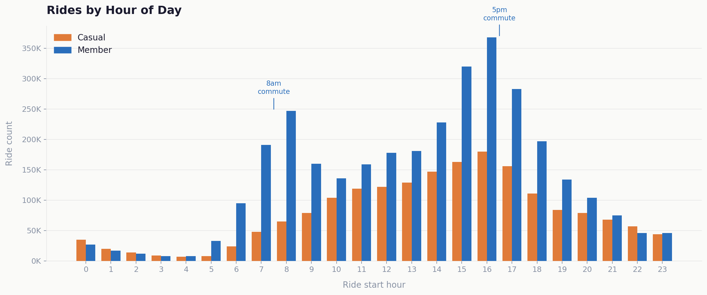
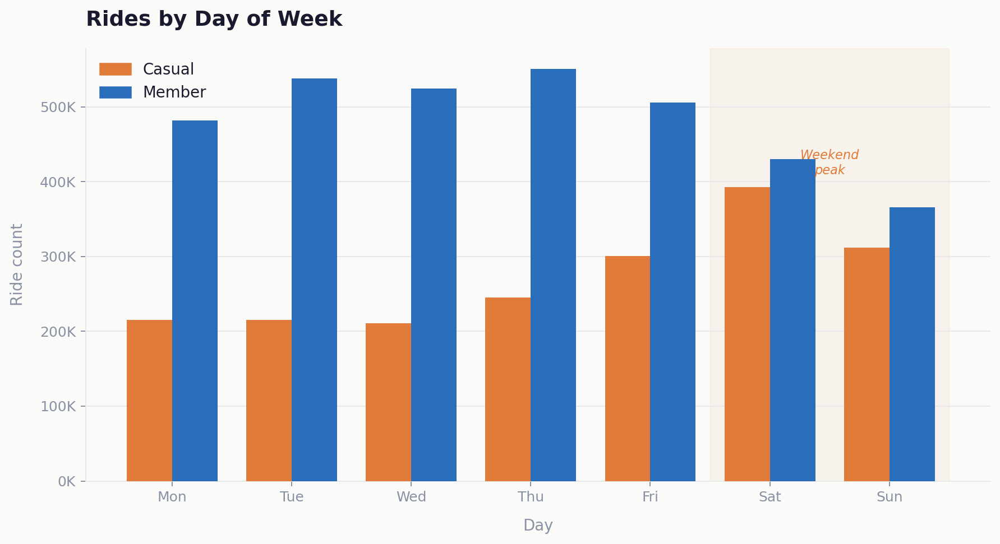
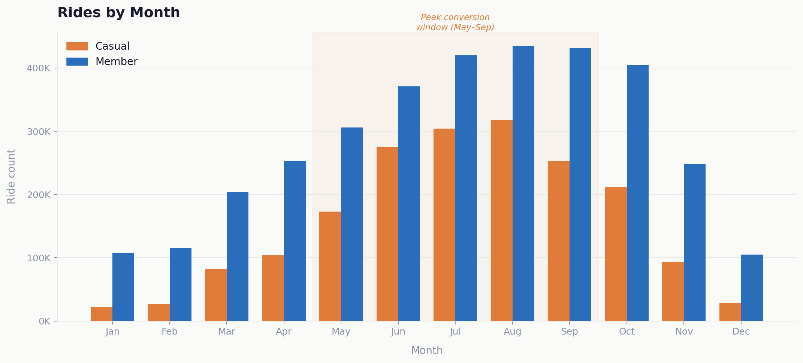
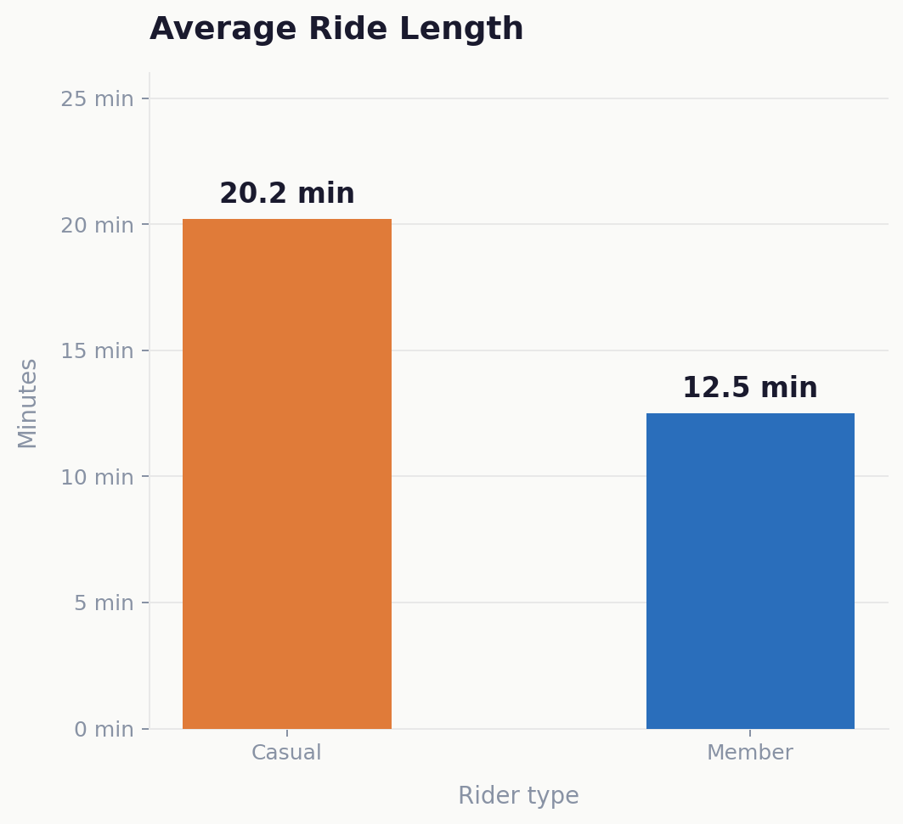
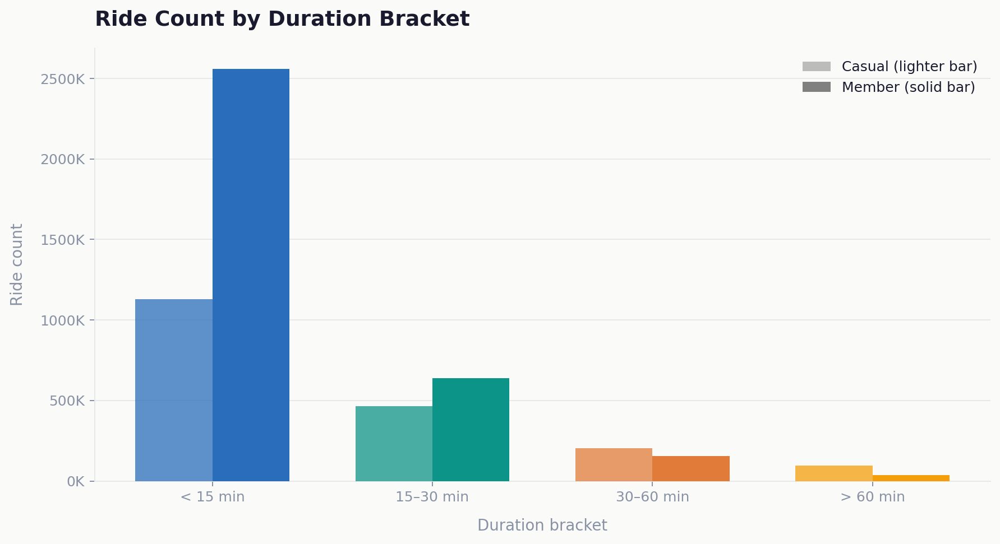

# Cyclistic Bike-Share: Rider Behaviour Analysis
### Google Data Analytics Capstone — Case Study 1

**Peter Francis Muthukkalai**

---

## Overview

This case study was completed as part of the Google Data Analytics Professional Certificate. I took on the role of a junior data analyst at **Cyclistic**, a fictional bike-share company in Chicago, and was tasked with answering a core business question:

> *"How do annual members and casual riders use Cyclistic bikes differently?"*

The findings were used to inform a marketing strategy aimed at converting casual riders into annual members.

---

## Business Context

Cyclistic operates a fleet of 5,800+ bikes across 692 docking stations in Chicago. The company offers three pricing tiers: single-ride passes, full-day passes, and annual memberships. Finance analysts have identified that **annual members are significantly more profitable** than casual riders.

Rather than targeting new customers, the Director of Marketing believes the highest-ROI opportunity is converting existing casual riders — people who already use the service — into annual members.

---

## Tools Used

| Tool | Purpose |
|---|---|
| **Microsoft Excel** | Primary analysis environment — pivot tables, charting, formula-based column creation |
| **Power Query** | Combined 12 monthly CSV files, removed nulls and duplicates, standardised column types |
| **Pivot tables** | Aggregated ride counts and average durations by rider type, day, month and hour |

---

## Data Source

- **Provider:** Motivate International Inc. (public licence)
- **Period:** 12 months of historical trip data
- **Size:** ~5.7 million ride records across 12 CSV files
- **Fields:** Ride ID, bike type, start/end timestamps, station names, rider type (casual / member)
- **Privacy:** No personally identifiable information included

---

## Data Cleaning

Before analysis, the dataset was audited for quality issues. The following records were excluded:

| Issue | Decision | Reasoning |
|---|---|---|
| Negative `ride_length` | Excluded | End time before start time is physically impossible — data entry or system error |
| `ride_length` > 24 hours | Excluded | Likely undocked return; treated as clocking error, not a genuine trip |
| `ride_length` < 2 minutes | Excluded | Consistent with equipment faults or aborted starts, not completed journeys |
| Blank rows | Excluded | Rows missing key fields (timestamps, station, rider type) cannot be used in aggregations |
| Duplicate records | Excluded | Identical ride_id + timestamps removed to avoid double-counting |

---

## Analysis & Key Findings

### 1. Riding by Hour — The Commute Signal

Members show two sharp spikes at **8am and 5pm** on weekdays — a clear commute pattern. Casual riders build gradually from mid-morning and plateau through the afternoon, consistent with leisure use. This single chart captures the core behavioural difference between the two groups.

---

### 2. Riding by Day of Week — Weekday vs Weekend

Casual riders peak on **Saturday (~393K rides)** — nearly double their weekday average. Members are remarkably consistent Monday–Friday and actually dip at weekends, confirming that bike use is habitual and utility-driven for members, recreational for casuals.

---

### 3. Riding by Month — The Seasonal Gap

Both groups peak in summer (July–August), but casual ridership drops by **~93%** from peak to January — highly weather-dependent. Members maintain over 25% of their peak volume even in winter, reflecting year-round habitual use. The May–September window is the prime opportunity for conversion campaigns.

---

### 4. Average Ride Length

Casual riders average **20.2 minutes** per trip versus **12.5 minutes** for members — a 62% difference. Longer, exploratory rides support the leisure hypothesis, while shorter, purposeful trips reinforce the commute pattern for members.

---

### 5. Ride Duration Breakdown

The majority of rides in both groups are under 15 minutes. However, casuals have a proportionally higher share of 30–60 minute rides, further confirming leisurely, exploratory usage.

---

## Summary

| Dimension | Casual Rider | Annual Member |
|---|---|---|
| **Primary use** | Leisure & recreation | Commuting to work |
| **Peak time** | Mid-day, weekends | 8am & 5pm, weekdays |
| **Peak season** | Summer (May–Sep) | Year-round |
| **Avg ride length** | ~20 min | ~12.5 min |
| **Ride pattern** | Exploratory, longer | Direct, shorter |

> **Core insight:** Members use Cyclistic to get to work. Casual riders use it to enjoy the city. Converting casual riders means showing them that the bike they enjoy on Saturday can also be the one that gets them to work on Monday.

---

## Top 3 Recommendations

### 01 · Summer Weekend Conversion Campaign *(Highest Priority)*
Run targeted digital and in-app campaigns on Fridays–Sundays between May and August — when casual ridership peaks at ~393K rides/Saturday. Offer a time-limited annual membership discount at high-traffic leisure stations near parks, waterfronts, and tourist areas.

**Messaging:** *"You already ride with us — make it year-round."*

---

### 02 · Discounted Membership Trial for Commute-Adjacent Riders *(Medium Priority)*
Identify casual riders who use Cyclistic on 3+ weekdays in a month — they are already commute-adjacent. Offer a discounted 30-day membership trial with push notifications timed to the 8am and 5pm commute peaks. Lower the financial barrier to entry and frame it around a single real use case.

**Messaging:** *"Cycle to work — your morning commute sorted."*

---

### 03 · Winter Bridge Pass + Early-Bird Membership *(Retention & Pipeline)*
Introduce a 3-day weekend pass (Fri–Sun) as a stepping-stone product in off-peak months (November–February). Casual rides drop 93% in winter — a low-cost pass maintains engagement and brand touchpoints. Pair it with an early-bird annual membership offer redeemable the following spring, converting engaged casuals before peak season begins.

---

## Next Steps

- **Validate with qualitative data** — Conduct short rider surveys at high-casual stations to test whether commuting is a stated barrier and what pricing would motivate conversion
- **Geo-analysis of top casual stations** — Identify which docking stations over-index for casual weekend traffic to focus physical marketing in the right locations
- **A/B test the summer campaign** — Run two creative variants in July: one price-led, one lifestyle/commute framing; measure conversion rate through Q4
- **Track trial-to-member conversion rate** — The percentage of discounted trial members who convert to full annual membership is the single most important metric for the campaign

---

## Presentation

The full slide deck is available in this repository:
- 📊 [`Cyclistic_Bike_Share_Analysis.pdf`](Cyclistic_Bike_Share_Analysis.pdf) — view in browser
- 📁 [`Cyclistic_Bike_Analysis.pptx`](Cyclistic_Bike_Analysis.pptx) — download and edit

---

## About

**Peter Francis Muthukkalai**  
Google Data Analytics Professional Certificate — Capstone Project  

*This analysis was completed as part of the Google Data Analytics Certificate programme. Cyclistic is a fictional company; the dataset is provided by Motivate International Inc. under public licence.*
